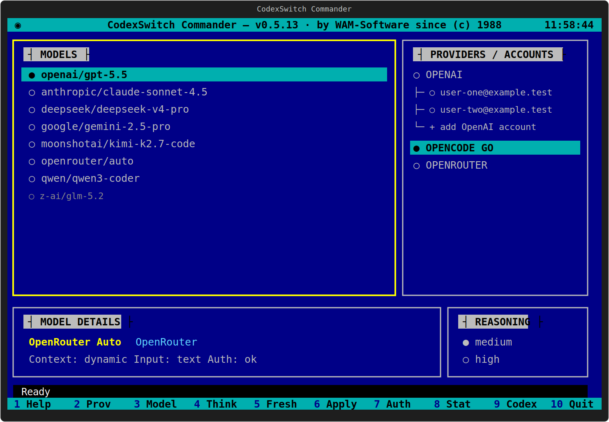

# CodexSwitch Commander

```text
   ___          _            __          _ _       _
  / __\___   __| | _____  __/ _\_      _(_) |_ ___| |__
 / /  / _ \ / _` |/ _ \ \/ /\ \\ \ /\ / / | __/ __| '_ \
/ /__| (_) | (_| |  __/>  < _\ \\ V  V /| | || (__| | | |
\____/\___/ \__,_|\___/_/\_\\__/ \_/\_/ |_|\__\___|_| |_|
                    C O M M A N D E R
```

Switch Codex CLI between native OpenAI accounts, Azure OpenAI, OpenCode Go
models and OpenRouter models from one polished terminal control center.



[](https://github.com/wmostert76/codexswitch/actions/workflows/ci.yml)
[](https://github.com/wmostert76/codexswitch/releases)

## What it does

CodexSwitch keeps normal `codex` usage simple: pick a provider, account, model
and reasoning mode once, then launch Codex normally with that active
configuration.

It is built for three workflows:

| Provider | What CodexSwitch handles |
| --- | --- |
| OpenAI | Native Codex auth, saved account switching and rotated token sync |
| Azure OpenAI | Unified-proxy Responses v1 passthrough and fixed `gpt-5.6-sol` model selection |
| OpenCode Go | Own API-key store, unified Responses-compatible proxy and model catalog |
| OpenRouter | API-key storage, model catalog and unified tool-compatible proxy routing |

## Highlights

- Commander-style TUI with Providers, Models and Reasoning panes
- OpenAI multi-account management without losing rotated refresh tokens
- Azure OpenAI selection for a single configured `gpt-5.6-sol` deployment
- OpenRouter and OpenCode Go API-key flows that never write keys to `config.toml`
- Persistent provider/model defaults with on-demand proxy startup from Commander
- One provider proxy with isolated Azure, OpenCode Go and OpenRouter routes
- Provider/model isolation so OpenAI accounts never mix with OpenCode/OpenRouter
- Reproducible local install with dependency detection and on-demand proxy units
- GitHub releases generated from `CHANGELOG.md`

## Install

Requirements:

- Linux with `sudo` and one of `apt`, `dnf`, `yum`, `pacman`, `zypper` or `apk`
- OpenRouter API key for OpenRouter support
- OpenCode Go API key for OpenCode Go support
- `systemd` and `sudo` for installation into `/usr/local/bin`

```bash
git clone https://github.com/wmostert76/codexswitch.git
cd codexswitch
./install.sh
```

Start the app:

```bash
codexswitch tui
```

The installer detects missing Python/venv/npm dependencies on common Linux
distros, installs or updates the Codex CLI when needed, creates `.venv`,
installs Textual, links commands into `/usr/local/bin`, and installs proxy
systemd units without enabling them at boot. Commander starts the unified
provider proxy when the TUI opens and checks it again immediately before Codex.
On an existing
git checkout, re-running `./install.sh` fetches without modifying tags and
performs a safe `git pull --ff-only`, so it can be used
as the normal update command:

```bash
cd ~/codexswitch
./install.sh
codexswitch version
```

`codexswitch`, `codexswitch tui` and `codexswitch status` automatically check
for a newer GitHub release or newer `origin/main` revision and immediately run
the same upgrade path as `codexswitch update` when the checkout is clean. Set
`CODEXSWITCH_NO_AUTO_UPDATE=1` to suppress this startup check.

On Windows, the updater refreshes `requirements.txt` with the native Python
interpreter that is running CodexSwitch. It does not invoke the Linux-only
`install.sh` through WSL or Git Bash.

## Native launcher binaries

GitHub releases include a small native Go `codexswitch` launcher for Windows,
Linux and macOS. The launcher starts the Python Commander backend from a local
checkout. Put the binary in the repository root or set `CODEXSWITCH_HOME` to
the checkout path.

Release assets:

```text
codexswitch-windows-amd64.exe
codexswitch-linux-amd64
codexswitch-linux-arm64
codexswitch-darwin-amd64
codexswitch-darwin-arm64
SHA256SUMS
```

## Keyboard workflow

The Commander TUI follows a left-to-right `Providers → Models → Reasoning`
workflow, with full-width model details below the three selection panes. The
cyan cursor shows the item being inspected, `●` marks the active Codex
configuration and `◆` marks a pending selection. Moving through choices only
updates the pending selection; Codex configuration is not changed until you
apply or launch it. The responsive layout supports terminals from `80x24`
upward and shows a resize message below that minimum.

| Key | Action |
| --- | --- |
| `↑` / `↓` | Move through choices in the focused pane |
| `Home` / `End` | Jump to the first or last choice |
| `PageUp` / `PageDown` | Move one page through a long list |
| `←` / `→` | Move to the previous or next pane |
| `Tab` / `Shift+Tab` | Cycle forward or backward through the panes |
| `Enter` | Confirm and move right; from Reasoning, apply and launch Codex |
| `/` | Search models by display name or full model ID |
| `F1` or `?` | Help |
| `F2` or `p` | Providers/accounts pane |
| `F3` or `m` | Models pane |
| `F4` or `t` | Reasoning pane |
| `F5` or `r` | Refresh the selected provider catalog, including native OpenAI Codex models |
| `F6` or `a` | Apply the pending selection without starting Codex |
| `F7` or `l` | Authenticate the pending provider |
| `F8` or `s` | Reload active status |
| `F9` or `c` | Apply and start Codex with sandbox bypass and search |
| `F10` or `q` | Quit; pending changes require confirmation |
| `Esc` | Close a dialog/search, or reset the pending selection to active |

Model search is case-insensitive. Use `↑`/`↓` inside the filtered results,
`Enter` to accept a model and continue to Reasoning, or `Esc` to clear the
filter. Single-letter aliases apply only on the main screen, so they do not
interfere with typing in search or credential dialogs.

OpenRouter keeps its search field visible because its catalog is much larger.
Its model list shows separate `INPUT` and `OUTPUT` prices in USD per million
tokens, consistently formatted with two decimals. Click the `MODEL` or grouped
price heading to sort ascending; click the same heading again to reverse the
order. Cost sorting uses the combined input and output price.

Cached catalogs load in the background without a network refresh at startup.
Use `F5` to refresh only the selected provider. The last usable catalog
remains visible if a refresh fails, and Apply/Launch
stays unavailable while the selected provider is still busy. The Commander
splash appears once per installed version and remains available from Help.

## CLI reference

```bash
codexswitch                         # show help
codexswitch tui                     # start Commander TUI
codexswitch use PROVIDER MODEL [REASONING]
codexswitch auth [openai|azure|opencode-go|openrouter]
codexswitch account add             # OpenAI device sign-in
codexswitch account save [EMAIL]
codexswitch account use user@example.com
codexswitch refresh                 # OpenCode Go + OpenRouter catalogs
codexswitch update [--check]        # update from latest GitHub release
codexswitch list
codexswitch status
codexswitch run [PROMPT...]
codexswitch version
```

From the TUI, `F9` applies the current selection and then starts Codex as:

```bash
codex --dangerously-bypass-approvals-and-sandbox --search
```

In the normal keyboard flow, choose a model, press `Enter` to move to
reasoning, choose the reasoning mode, then press `Enter` again to apply and
start Codex the same way as `F9`.

Examples:

```bash
codexswitch tui
codexswitch account add
codexswitch auth openrouter
codexswitch auth azure
codexswitch use azure gpt-5.6-sol low
codexswitch use openai gpt-5.5
codexswitch use opencode-go glm-5.2 high
codexswitch use opencode-go minimax-m3 thinking
codexswitch use openrouter anthropic/claude-sonnet-4.5
```

All non-native providers share one loopback process on port `14555`, using
stable provider routes: `/opencode-go/v1`, `/openrouter/v1` and `/azure/v1`.
OpenRouter and OpenCode Go retain their isolated conversion behavior; Azure
remains a passthrough that adds its vault-backed `api-key` header. Dispatch is
never inferred from model names. Commander shows one compact health indicator
and starts the unified proxy after F9 closes the TUI. F5 refreshes the display.
Windows creates no service or Scheduled Task; the Linux unit is disabled at
boot and started on demand.

## Authentication and storage

CodexSwitch reuses provider-native auth stores where possible and keeps secrets
out of the repository.

| Secret | Nu opgeslagen in | Hoe het werkt |
| --- | --- | --- |
| Actieve OpenAI login | `~/.codex/auth.json` | `codex login` blijft eigenaar van de actieve login |
| Opgeslagen OpenAI accounts | Gedeelde versleutelde vault | CodexSwitch haalt accounts bij ieder gebruik opnieuw uit Object Storage |
| Azure OpenAI credentials | Gedeelde versleutelde vault | Endpoint en API-key blijven uit `config.toml` en lokale caches |
| OpenCode Go API key | Gedeelde versleutelde vault | De token helper doet een verse remote vault-read |
| OpenRouter API key | Gedeelde versleutelde vault | De unified proxy doet een verse remote vault-read |

Vault flow:

| Stap | Wat gebeurt er |
| --- | --- |
| 1 | De wizard migreert de lokale vault client-side versleuteld naar Hetzner S3 |
| 2 | S3-credentials en de gedeelde passphrase staan alleen in de OS-keyring, encrypted systemd credentials of environment |
| 3 | CLI/proxy-reads halen S3 opnieuw op; Commander gebruikt één RAM-cache per TUI-sessie en F5 ververst die expliciet |
| 4 | Na verificatie verwijdert de wizard lokaal `vault.enc` en `vault.key` |
| 5 | De TUI toont vooraan in de statusbalk `VAULT ONLINE` of `VAULT OFFLINE` |
| 6 | Actieve Codex config blijft apart in `~/.codex/auth.json` en `~/.codex/config.toml` |

Run this after upgrading an existing install:

```bash
codexswitch vault migrate
```

Configure the shared vault on the first or a new machine with the interactive
wizard. The endpoint and bucket defaults are prefilled:

```bash
codexswitch vault remote configure
codexswitch vault status
```

The wizard asks for the S3 Access Key ID, S3 Secret Access Key and the same
shared vault passphrase on every machine. It uses
`https://fsn1.your-objectstorage.com`, bucket `wmostert` and object
`codexswitch/vault.enc` by default. On headless Linux hosts without an OS
keyring, the wizard automatically stores these three bootstrap secrets as
machine-bound encrypted systemd user credentials. CLI, TUI, the OpenCode token helper and
the proxy read that same protected storage after every restart.

Environment injection remains available for ephemeral deployments:

```text
CODEXSWITCH_S3_ACCESS_KEY_ID
CODEXSWITCH_S3_SECRET_ACCESS_KEY
CODEXSWITCH_REMOTE_VAULT_PASSPHRASE
```

`remote-vault.json` contains only endpoint, bucket, region and object name;
it never contains credentials or provider secrets.

Codex itself still owns the active `~/.codex/auth.json` file, and Azure
activation still writes the active provider settings required by Codex into
`~/.codex/config.toml`.

OpenAI account add uses Codex device authentication:

```bash
codexswitch account add
```

Azure, OpenRouter and OpenCode Go auth read API keys without terminal echo, or
through a paste/renew popup in the TUI. Azure asks only for the resource URL
and API key and normalizes the URL to `/openai/v1`. The Azure and OpenRouter
unified proxy routes read their keys directly from the protected vault, while
OpenCode Go uses its installed token helper. Provider, model and reasoning remain selected,
while Commander ensures the required proxy is running immediately before
Codex starts. No API key is stored in `~/.codex/config.toml`.

```bash
codexswitch auth azure
codexswitch auth openrouter
codexswitch auth opencode-go
```

## Unified provider proxy

OpenCode Go exposes a chat-completions style API. Codex expects the Responses
API. The unified local proxy bridges that gap and also routes OpenRouter and
Azure on `127.0.0.1:14555`. Its OpenCode Go engine handles:

- Responses input/output conversion
- custom/function/namespace tool conversion
- `apply_patch` freeform payload wrapping
- reasoning-effort mapping from model metadata
- proxy-local web-search fallback
- optional bearer auth for manual clients

Manage the unified Linux systemd service independently when explicit
always-on behavior is desired:

```bash
codexswitch proxy install
codexswitch proxy status
codexswitch proxy restart
codexswitch proxy uninstall
```

To require a dedicated proxy token for manual clients:

```bash
sudo systemctl edit codex-provider-proxy.service
# Add: Environment=CODEX_OPENCODE_PROXY_TOKEN=your-secret
sudo systemctl restart codex-provider-proxy.service
```

CodexSwitch itself authenticates with
`~/.config/codexswitch/opencode-go/auth.json`. Existing OpenCode auth is still
accepted as a migration fallback, but OpenCode CLI is no longer required for a
new installation.

## Releases

Current version is shown in all app surfaces:

```bash
codexswitch version
codexswitch --help
```

Release notes are maintained in [CHANGELOG.md](CHANGELOG.md). Tags named `v*`
trigger the GitHub Release workflow.

## Uninstall

Remove only the unified provider proxy service:

```bash
codexswitch proxy uninstall
```

Remove installed CodexSwitch commands and the proxy service:

```bash
./uninstall.sh
```

The uninstaller removes installed commands and the proxy service. It leaves
Codex and CodexSwitch user configuration untouched.

## Credits

Idea, product direction and maintenance: by WAM-Software since (c) 1988

AI-assisted implementation: OpenAI Codex

## License

MIT
